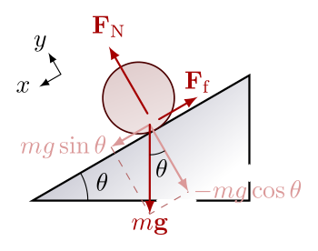
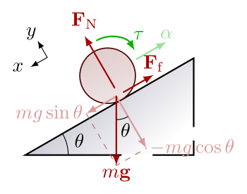

In this tutorial we want to calculate the motor ratings for a 4-wheel mobile robot platform.

<!-- more -->

## Introduction
The first rule you should know is: **No matter what happens, the object should stays at its position**. The other definition of this is: **The object should reamins in `static equilibrium`**, any translation or any rotation is unacceptable when we say an object is in static equilibrium.

So, an object which is in static equilibrium has the following conditions:
- The sum of the forces on it in each direction **MUST** be zero.
- The sum of the torques on it in each direction **MUST** be zero.
- It's linear momentum is zero. (`P=mv` should be equal to zero. `m` as object mass cannot be zero, so the `v` which is object linear velocity is zero.)

We pass this because we want to calculate the motor sizing and I just mention it because I think we will need it later, but you can google it if you want to learn more about it, `right`? Also you should be familiar with vectors and Power, if you don't, you should research them before reading this article.

## Calculating the Torque $T$

Imagine the robot moves upward on an incline with the angle $\theta$ and the robot has a constant velocity and there is enough friction between the wheel and the surface to prevent robot motion from slipping. In this case the robot should overcome to the earch gravitational force; And yes, the linear momentum is not zero, so the Static Equilibrium conditions are not met for the situation. If we look at the forces on the wheel, we notice that the force that cause robot move downward is $mg\sin(\theta)$.

  

In the image below, there is a torque $\tau$ which is caused by friction $F_f$. Assuming $R$ as the wheel raduis, we have:

$$
\tau = F_f * R
$$

But, what if we want the robot to go upward with acceleration $\alpha$? 

  

Remember the `Newton's Second Law of Motion` formula:

$$
F = ma
$$

Note the equation of horizontal forces:

$$
\sum F_x = F_f - mg\sin(\theta)
$$

So, we have:

$$
  ma = \dfrac{\tau}{R} - mg\sin(\theta) 
$$

To get the value of torque needed to make robot go upward with acceleration `\alpha`, we have:

$$
  \tau = mR(a + g\sin(\theta))
$$

The value calculated here is the **total** torque required, it means if the robot have $N$ number of drive wheels, each drive wheel should produce a torque equal to $T = \frac{\tau}{N}$.

## Some words about efficiency $\eta$

In real world there are always imperfections like cheap equipments don't act as they should do, motor internal friction, the surface and the wheels, motor drivers, the gearbox make their part to loose the efficiency. Thinking of this, makes us to select a `Safety Factor` for the motor, the other documentations noted that we should choose a safety factor in the range of $1.5 - 2.25$. It means the amount of torque the motor can provide (that we calculated before) should multiplied by this number and the motor controller should expect more current to deliver for the motor. In other words, we need a more powerfull motor than we calculated before, I will use $S$ to present the factor of safety in the formula below.

Now we have the torque required for each drive wheel, so we can calculate the power needed for each motor using the equation below:

$$
P_{motor} = S T \omega
$$

The $\omega$ (in $rad/s$) is angular velocity and is noted on the motor. Assigning the maximum angular velocity, will give us the motor maximum power. The equation above also known as the output power formula of the motor ($P_o$) and we will use it later to calculate the efficiency.

Also we know that the input power formula of the motor is:

$$
P_i = VI
$$

So, the efficiency of the motor can be calculated using two equations above:

$$
\eta = \dfrac{P_o}{P_i} = \dfrac{ST\omega}{IV}
$$

## Conclusion

So, this is the end of this tutorial. The motor you peek it up should have the ability to supply the maximum power of $P_o$ with its maximum angular velocity. You also should provide voltage (Voltage rated for the motor) and enough current (Maximum current for the motor) to make robot operate without any problem. Try to seperate/decouple the power supply of the electronics and the motors in order to reduce the noise given to them, and voltage drop on the power lines.

<!-- more -->
