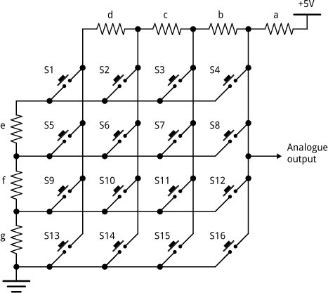
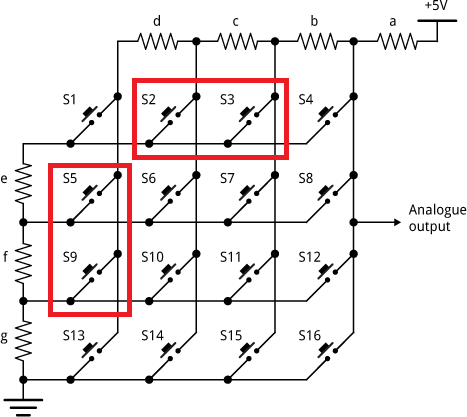

When I needed to manage more than 20 switches in one of my electronic projects, 
I chose resistor networks over the row-column method for reading the switches

Here is the essential calculation for the resistor network.

<!-- more -->

To keep this article concise, I will mention some useful links I found helpful:

- [This one](http://www.lispology.com/show?10QY) which is the main article (the one that inspired me) and use a `LISP` program to calculate the optimal solution.
- [The old one](https://www.purchiaroni.com/progetti/Matrix/Matrix.html) which is in Italian and includes great details about the problem, 
the writer used an executable tool available for download.

Both links indicate that their tools can take days or hours to complete the calculations.
While time should not be an issue with today's computers, 
I wanted to rewrite the tool, 
I don't use LISP personally or executables I've found on the Internet. 

## Explaination

To avoid reinventing the wheel, I initially began studying the LISP program.
In this section, I will explain my observations from the code; feel free to skip it if you have already read the links above.

The tool applies a brute-force approach to evaluate the resistor values, to find the maximum of the smallest gaps across various resistor combinations.
and there is no limit in the source code for cases where resistors have equal values. 
For example, when `d` and `e` are equal, it is impossible to determine whether switch `S2` or switch `S5` is pressed.
Similarly, you cannot use a resistor value in the columns if it has already been used in the rows.
Please remember that `a` is not either the column resistor or the row resistor.

 

  

In the image above, when the `S16` switch is pressed the analog value connects to GND and the minimum value corresponds to this switch.
The highest value is when all resistors (`a` is always in the path) are in the path which means the `S1` switch is pressed.

At first glance the minimmum gap for the ADC values is where the smallest resistor in the network comes to the path 
when all other resistors in the other side are already in the path. The resistors are shown in the image below. But literally the minimum gap can be because of adding/removing a column resistor to/from the path and removing/adding another row resistor in a way that the value difference was small, in this case the gap would be small if the `a` resistor is big enough.

  

I have also gathered insights from previous work, such as the limitations of the ADC sampling rate due to output impedance. 
Additionally, you can multiply the values by a consistent factor.
Now we can go further and implement the calculator.

## Implementation

I have used the genetic algorithm to solve the problem, this can significantly improve the time efficiency, but it comes with caveats regarding precision and convergence. It guarantees that the final result is close enough to the exact solution but it may not be the solution you looking for. I also performed some tests on it and I figured out it may require thousands of generations to achieve a slight improvement in the best answer.

You can find my code in [this Github repository](https://github.com/the-this-pointer/resistor-network-calculator)
